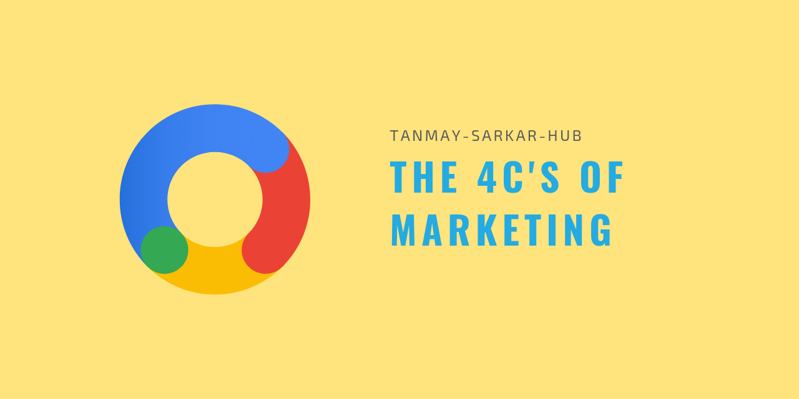

## Welcome to Lauterborn

This blog is about 4C's of marketing as proposed by Schultz, Tannenbaum and Lauterborn in 1993 under the concepts of [Integrated Marketing Communication](https://en.wikipedia.org/wiki/Marketing_communications#Integrated_marketing_communications). You can read more about [Prof. Robert F. Lauterborn](http://www.rlauterborn.com/bio.php). Here is one interview on [YouTube](https://www.youtube.com/watch?v=FtGlAPo-CG4). This 5 minutes video has the message which we will follow throughout the blog. The 4C's of marketing is an enlightened everion of [Prof. McCarthy's](https://en.wikipedia.org/wiki/E._Jerome_McCarthy) [4P's of marketing](https://en.wikipedia.org/wiki/Marketing_mix). 4P's of marketing was proposed in 1960. 

Here is the thought process as we move away from 4P's to 4C's.
> 
- Forget **Product**, study **Consumer's** wants and needs.
- Forget **Price**, understand the consumer's **Cost** satisfy that want or need.
- Forget **Place**, think consumer's **Convenience** to buy.
- Forget **Promotion**, it is actually **Communication**.

There are certain realities which are driving this shift.
> 
- The seller can no longer sell whatever they make.
- The seller can only sell what someone specifically wants to buy.
- The money the consumer pays is only one kind of cost.
- The customer needs not to go from store to store to buy what she needs.
- The customers know more than the sellers.

Finally Steve Jobs took it even further - 
> Some people say, "Give the customers what they want." But that's not my approach. Our job is to figure out what they're going to want before they do. I think Henry Ford once said, "If I'd asked customers what they wanted, they would have told me, 'A faster horse!'" People don't know what they want until you show it to them. That's why I never rely on market research. Our task is to read things that are not yet on the page.

**Read more**:
- [Understanding the Consumer Need](https://tanmay-sarkar-hub.github.io/lauterborn/consumer/consumer)
- [Understanding the Cost](https://tanmay-sarkar-hub.github.io/lauterborn/cost/cost)
- [Understanding the Convenience](https://tanmay-sarkar-hub.github.io/lauterborn/convenience/convenience)
- [Understanding the Communication](https://tanmay-sarkar-hub.github.io/lauterborn/communication/communication)