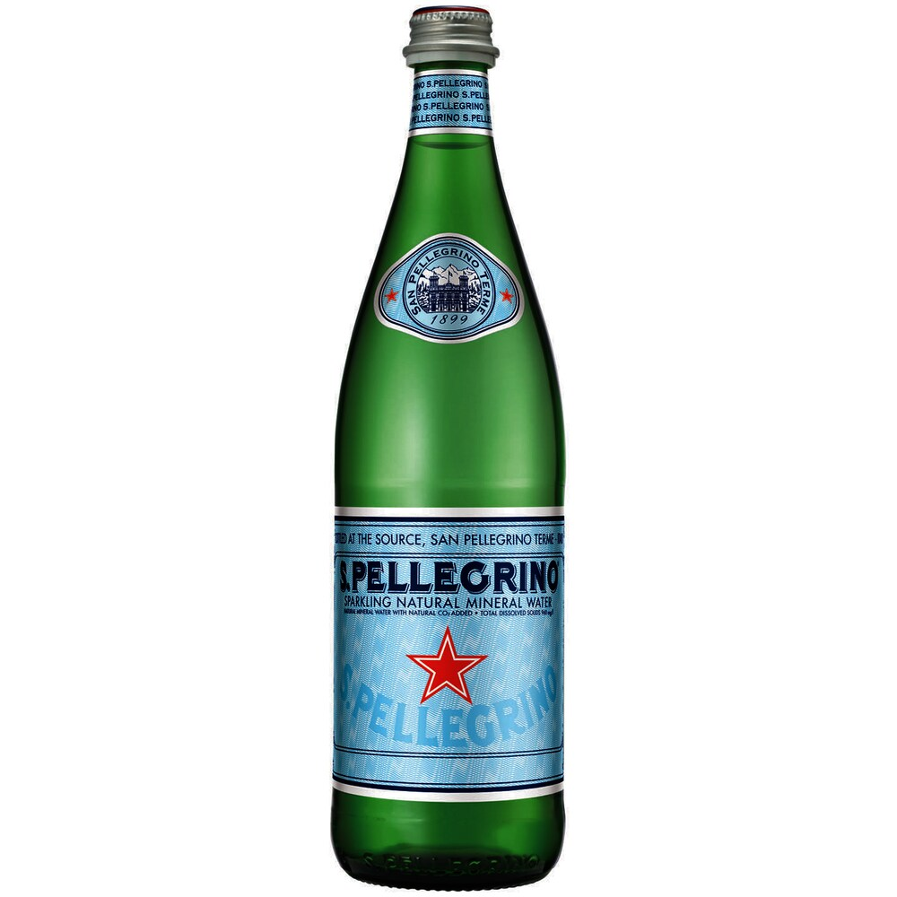

## San Pellegrino

##### Background
The product originates in the rich town of San Pellegrino Terme. The water comes from the natural springs within the Italian Alps. The water is heavy in minerals and with an addition of CO2, it feels crispy. The spring was known to people since the 12th century. The city became a vacation spot and people across Eupore started to visit the city to have a good time with the highest class of the society. So, the product has a great attraction due to its rich history and distinctive flavour.

