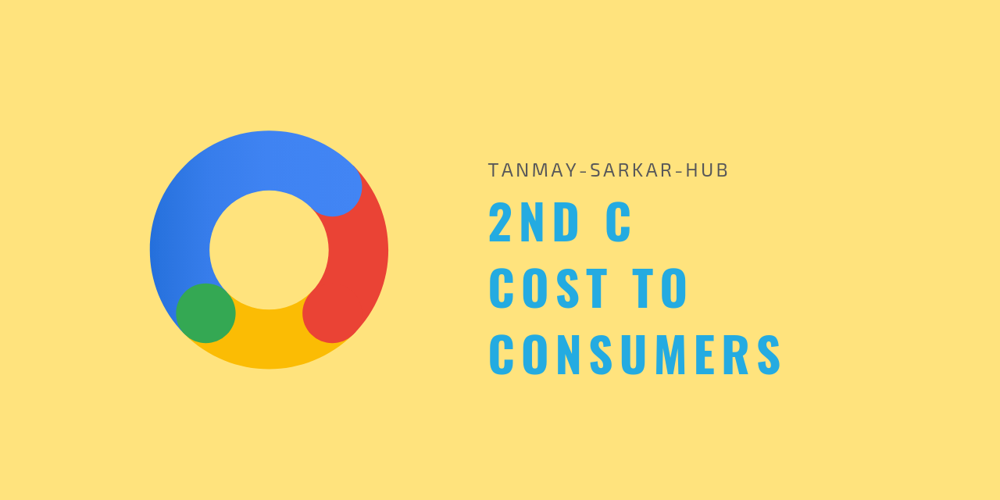

## Understanding the Cost

##### Characteristics
- A total of purchase cost, use cost, and post use cost
- Purchase cost includes -
	- Cost of searching
	- Cost of gathering information
	- Cost of transporting
	- Financial risk
	- Performance risk
	- Physical risk
	- Time risk
	- Social risk
	- Psychological risk
- Use cost
	- Resource consumed while using
	- Maintenance cost
- Post-use cost
	- Cost of collecting
	- Cost of storing
	- Cost of disposing

##### Case studies
_will be added soon_
